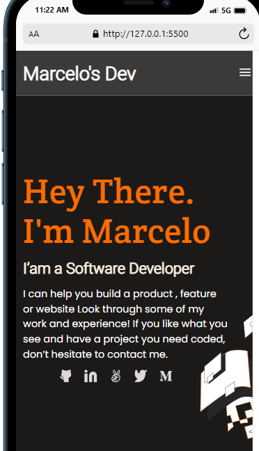

# Portfolio-MY21-Marcelo
My Portfolio of Web Development

> Project created for my first mobile version of my Portfolio

This project is an asset because it will set the foundations of my web development journey

## Built With

- HTML
- CSS
- Linter
- Figma

## Author

👤 **Author**

- GitHub: [@marcelosdata](https://github.com/marcelosdata)
- Twitter: [@marcelo90](https://twitter.com/marcelo90)
- LinkedIn: [msn9](https://www.linkedin.com/in/msn9)

## 🤝 Contributing

Contributions, issues, and feature requests are welcome!

## 📝 License

This project is [MIT](./MIT.md) licensed.
